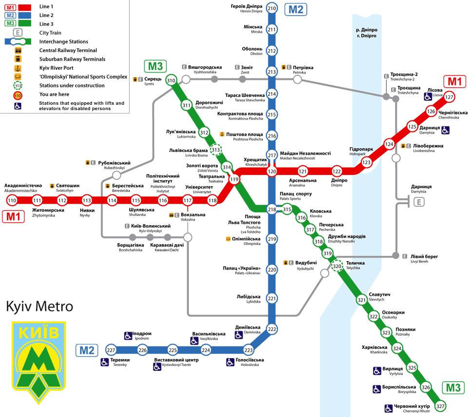
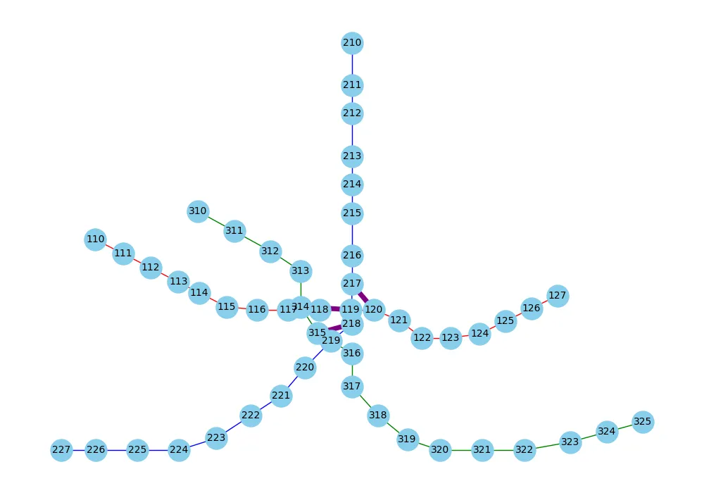

# goit-algo-hw-05

## Передумова

Налаштуйте `.venv` та встановіть залежності

```bash
python -m venv .venv
.\.venv\Scripts\Activate.ps1
pip install -r requirements.txt
```
## Завдання 1

Створіть граф за допомогою бібліотеки `networkX` для моделювання певної реальної мережі (наприклад, транспортної мережі міста, соціальної мережі, інтернет-топології).

Для створення графа реальної мережі було взято карту метро м. Києва



За допомогою функцій апроксимації та визначення позицій станцій (вершин) на уявній площині міста було отримано наступний 
граф мережі, де кожне ребро має дві додаткові характеристики: колір та випадкова величина вага, яка може означати час 
руху поїзда між станціями або час пішого переходу миж лініями 



### Аналіз основних характеристик графа

* К-ть вершин: 52
* К-ть ребер: 52
* max та min ступені вершин: 3, 1
* Ступінь центральності top10:
  ```
  [('119', 0.058823529411764705), ('120', 0.058823529411764705), ('217', 0.058823529411764705), ('218', 0.058823529411764705), ('314', 0.058823529411764705), ('315', 0.058823529411764705), ('111', 0.0392156862745098), ('112', 0.0392156862745098), ('113', 0.0392156862745098), ('114', 0.0392156862745098)]
  ```
* Близькість вузла top10:
  ```
  [('217', 0.17832167832167833), ('218', 0.17832167832167833), ('315', 0.17832167832167833), ('119', 0.17465753424657535), ('120', 0.17465753424657535), ('314', 0.17465753424657535), ('316', 0.16037735849056603), ('219', 0.159375), ('216', 0.1574074074074074), ('118', 0.15644171779141106)]
  ```
* Посередництво вузла top10:
  ```
  [('218', 0.4156862745098039), ('315', 0.4156862745098039), ('119', 0.3780392156862745), ('217', 0.3780392156862745), ('120', 0.3592156862745098), ('314', 0.30745098039215685), ('316', 0.2964705882352941), ('118', 0.2698039215686274), ('219', 0.2698039215686274), ('317', 0.2698039215686274)]
  ```

Як і очікувалось, вузли останніх трьох характеристик майже одні і ті самі, тому що метро Києва доволі збалансовано і має 
ожнакому к-ть переходів (ребер) між лініями метро у центральній частині графу.


## Завдання 2

Напишіть програму, яка використовує алгоритми DFS і BFS для знаходження шляхів у графі, який було розроблено у першому завданні.

Далі порівняйте результати виконання обох алгоритмів для цього графа, висвітлить різницю в отриманих шляхах. Поясніть, чому шляхи для алгоритмів саме такі.

### Спостереження

Основна різниця між алгоритмами Depth-First Search (DFS) та Breadth-First Search (BFS) полягає у способі обходу графа:

1. **DFS (глибина в першу чергу)**:
   - DFS заглиблюється в граф, досліджуючи якомога далі кожну гілку, перш ніж повернутися назад.
   - У наведеному прикладі, DFS починає з вершини 110 і продовжує йти до наступної вершини, поки не досягне кінцевої вершини або вершини без незвіданих сусідів. Потім він повертається назад і продовжує обхід з останньої незвіданої вершини.
   - Результат: 
     ```
     110 111 112 113 114 115 116 117 118 119 120 121 122 123 124 125 126 127 217 216 215 214 213 212 211 210 218 219 220 221 222 223 224 225 226 227 315 314 313 312 311 310 316 317 318 319 320 321 322 323 324 325
     ```

2. **BFS (ширина в першу чергу)**:
   - BFS досліджує всі сусідні вершини кожної вершини, перш ніж перейти до наступного рівня сусідніх вершин.
   - У наведеному прикладі, BFS починає з вершини 110 і досліджує всіх її сусідів, потім переходить до сусідів цих сусідів і так далі.
   - Результат:
     ```
     110 111 112 113 114 115 116 117 118 119 120 314 217 121 313 315 216 218 122 312 316 215 219 123 311 317 214 220 124 310 318 213 221 125 319 212 222 126 320 211 223 127 321 210 224 322 225 323 226 324 227 325
     ```

Отже, основна різниця між алгоритмами DFS і BFS полягає в порядку дослідження вершин:
- **DFS** досліджує глибоко, переходячи до наступної вершини до кінця, перш ніж повертатися назад.
- **BFS** досліджує широко, переходячи до всіх сусідів поточної вершини, перш ніж переходити до наступного рівня.

## Завдання 3

Реалізуйте алгоритм Дейкстри для знаходження найкоротшого шляху в розробленому графі: додайте у граф ваги до ребер та знайдіть найкоротший шлях між всіма вершинами графа.

### Знаходження найкоротшого шляху до станції метро Оболонь

Ваги в данній реалізації задаються випадково в проміжку між 0.5 до 2.0, що може відповідати коефіцієнту швидкості руху
потягу метро між станціями
Для переходів між лініями ваги задані явно (значення від 4 до 7), що може відповідати руху пішки між лініями.

```
Вершина    Відстань   Перевірено
------------------------------
110        20.2       Так
111        18.7       Так
112        18.2       Так
113        17.3       Так
114        16.5       Так
115        14.9       Так
116        13.4       Так
117        11.6       Так
118        11.0       Так
119        9.9        Так
120        9.4        Так
121        10.200000000000001 Так
122        11.500000000000002 Так
123        12.000000000000002 Так
124        12.800000000000002 Так
125        14.300000000000002 Так
126        15.600000000000003 Так
127        16.400000000000002 Так
210        3.0999999999999996 Так
211        1.7        Так
212        0          Так
213        0.5        Так
214        2.2        Так
215        3.7        Так
216        4.7        Так
217        5.4        Так
218        7.300000000000001 Так
219        8.3        Так
220        8.9        Так
221        9.5        Так
222        11.3       Так
223        12.700000000000001 Так
224        14.4       Так
225        16.0       Так
226        17.3       Так
227        19.3       Так
310        20.400000000000002 Так
311        19.3       Так
312        18.0       Так
313        16.3       Так
314        14.9       Так
315        14.3       Так
316        15.700000000000001 Так
317        17.3       Так
318        17.900000000000002 Так
319        18.700000000000003 Так
320        19.6       Так
321        20.200000000000003 Так
322        21.000000000000004 Так
323        21.700000000000003 Так
324        22.6       Так
325        24.1       Так
```